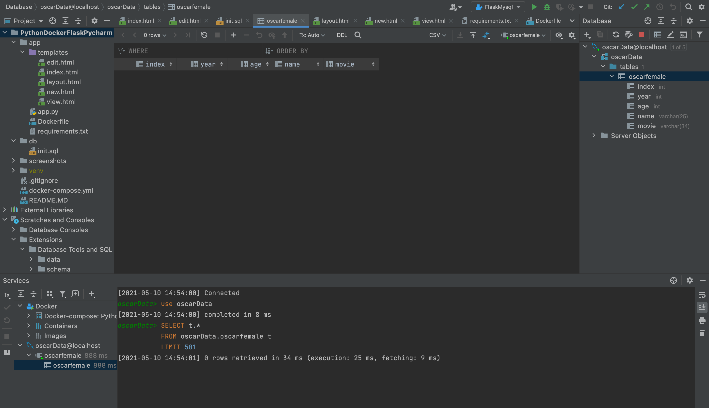
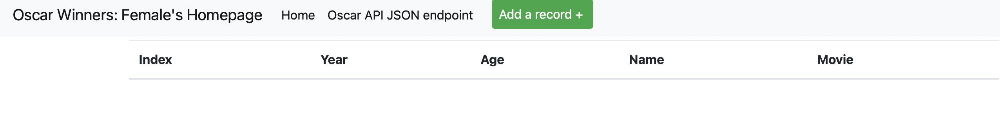

# Project Description
This project is a homework assignment to teach how to get Pycharm setup with Docker, Flask, MySQL, and Postman

[Download Assignment PDF Here](PPFSQL-Homework.pdf)

[View Assignment Video Here](https://youtu.be/QbMWNgrfAFg)

# The project showing that you can view YOUR data tables in pycharm:

# YOUR project running correctly in the browser displaying your homepage with your data

#Word file Submission: [Click Here](webpart3.docx)

